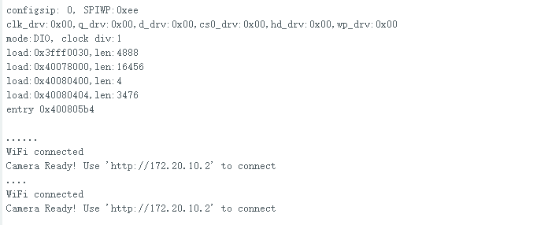
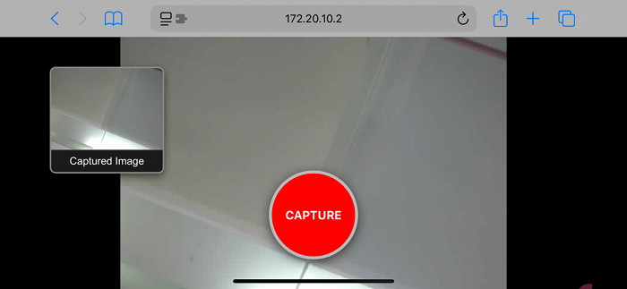

# MB0199 猫脸摄像头 黑色环保


## 概述

猫脸摄像头采用ESP32-S模组与OV3660摄像头模组，支持最小系统独立工作，可广泛应用于各种物联网应用、家庭智能设备、工业无线控制、无线监控、二维码无线识别、无线定位系统信号等物联网应用，支持二次开发以及各种物联网设备应用。

## 产品参数

- 采用低功耗、双核 32 位 CPU，可作为应用处理器。
- 主频高达 240MHz，算力达到 600 DMIPS。
- 内置 520 KB SRAM，外部 8MB PSRAM。
- 兼容 UART 。
- 支持 OV2640 和 OV3660 摄像头，内置闪光灯。
- 支持 TF 卡、多种休眠模式、WIFI 上传和 STA/AP/STA+AP 工作模式。
- 内置 Lwip 和 FreeRTOS。
- 支持 Smart Config/AirKiss 智能配置。
- 电源范围：5V
- 平均工作电流：0.21A
- 产品尺寸：55*51mm

## 连接与环境配置

**安装Arduino IDE（Windows）**

我们先到Arduino官方的网站：https://www.arduino.cc/en/software/#ide

下载最新版本的arduino开发软件，进入网站之后,如下图：

Arduino 软件有很多版本，有windows,mac linux系统的（如下图），而且还有过去老的版本，你只需要下载一个适合系统的版本即可。


这里我们以Windows系统的为例给大家介绍下载和安装的步骤。Windows系统的也有两个版本，一个版本是安装版的，一个是下载版的不用安装，直接下载文件到电脑，解压缩就可以用了。


一般情况下，我们点击JUST DOWNLOAD就可以下载了。

**环境配置**

第一步：使用Type-C数据线连接电脑与猫脸摄像头；

第二步：首先打开Arduino IDE，File-->Preferences-->Setings-->Lauguage;修改为简体中文接下来点击“OK”，就会自动切换为中文。


设置测试环境：
如果在 Arduino IDE 的板子类型中找到，可以跳到设置环境。

配置 esp32：转到 文件-->首选项，
配置 ESP url
复制 “https://dl.espressif.com/dl/package_esp32_index.json” 到“Additional Board Manager URLs”


配置开发板：打开工具-->板：“Arduino UNO”-->板管理器）
搜索 esp32 选择版本并安装;）


## 示例代码1

第 1 步：确保串口和板型参数正确


选择示例代码


修改摄像头类型：改成 CAMERA_MODEL_AI_THINKER


配置 WiFi：该WIFI要和所使用的电脑处于同一局域网内


点击IDE中的按钮进行代码的编译与烧录


如果 IDE 显示如下图，则表示测试代码上传成功。 编程完成后，打开 Arduino 右上角的 Serial monitor


选择 115200 波特率，按下重置按钮，LED 指示灯将闪烁。如果无法连接 WiFi，请再次按下重置按钮。


步骤1： 通过WiFi将电脑连接到开发板，并将上面显示的IP地址粘贴到Google或Foxfire浏览器的搜索框中。（其他浏览器可能不兼容）


步骤 2：设置参数如下，然后单击 开始流式传输。然后相机开始工作，WiFi 模块发热，串口显示大量通信数据。您无需担心。


## 示例代码2
第 1 步：确保串口和板型参数正确


第二步：复制示例代码并上传（**注意：记得修改WIFI名与WIFI密码为您需要连接的WIFI,猫脸摄像头需与网页端设备处于同一局域网**）
```c++
#include "esp_camera.h"
#include <WiFi.h>
#include <WebServer.h>

// --- 引脚定义 ---
#define PWDN_GPIO_NUM     32
#define RESET_GPIO_NUM    -1
#define XCLK_GPIO_NUM      0
#define SIOD_GPIO_NUM     26
#define SIOC_GPIO_NUM     27
#define Y9_GPIO_NUM       35
#define Y8_GPIO_NUM       34
#define Y7_GPIO_NUM       39
#define Y6_GPIO_NUM       36
#define Y5_GPIO_NUM       21
#define Y4_GPIO_NUM       19
#define Y3_GPIO_NUM       18
#define Y2_GPIO_NUM        5
#define VSYNC_GPIO_NUM    25
#define HREF_GPIO_NUM     23
#define PCLK_GPIO_NUM     22

const char* ssid = "keyes";//需要连接的WIFI
const char* password = "keyes12345678";//需要连接的WIFI密码

WebServer server(80);

void streamCamera() {
  WiFiClient client = server.client();
  if (!client) return;
  client.println("HTTP/1.1 200 OK");
  client.println("Content-Type: multipart/x-mixed-replace; boundary=frame");
  client.println();
  while (true) {
    camera_fb_t *fb = esp_camera_fb_get();
    if (!fb) continue;
    client.println("--frame");
    client.println("Content-Type: image/jpeg");
    client.print("Content-Length: ");
    client.println(fb->len);
    client.println();
    client.write(fb->buf, fb->len);
    client.println();
    esp_camera_fb_return(fb);
    delay(1);
  }
  client.stop();
}

void handleRoot() {
  String html = R"raw(
  <!DOCTYPE html>
  <html>
  <head>
    <meta name="viewport" content="width=device-width, initial-scale=1.0">
    <style>
      body { margin: 0; padding: 0; background: #000; font-family: Arial, sans-serif; overflow: hidden; }
      .stream-container { width: 100vw; height: 100vh; display: flex; justify-content: center; align-items: center; }
      #streamId { width: 100vw; height: 100vh; object-fit: contain; }
      .btn-capture {
        position: absolute; bottom: 40px; left: 50%; transform: translateX(-50%);
        width: 120px; height: 120px; background: #ff0000; color: white; border: 4px solid #bbb;
        font-size: 16px; border-radius: 50%; cursor: pointer; box-shadow: 0 4px 15px rgba(0,0,0,0.6);
        z-index: 10; display: flex; justify-content: center; align-items: center; text-transform: uppercase; font-weight: bold;
      }
      .thumb-container {
        position: absolute; top: 40px; left: 20px;
        width: 150px; background: rgba(0, 0, 0, 0.7); border: 2px solid #888;
        box-shadow: 0 4px 10px rgba(0,0,0,0.5); border-radius: 8px;
        overflow: hidden; cursor: pointer; display: none; z-index: 10; text-align: center;
      }
      #thumbId { width: 100%; height: 110px; object-fit: cover; display: block; }
      .thumb-label { color: #fff; font-size: 14px; padding: 6px 0; background: #1a1a1a; border-top: 1px solid #444; }
      .modal {
        display: none; position: fixed; top: 0; left: 0; width: 100vw; height: 100vh;
        background: rgba(0,0,0,0.95); z-index: 100; justify-content: center; align-items: center;
      }
      #modalImgId { max-width: 90vw; max-height: 90vh; object-fit: contain; border: 2px solid #fff; }
      .close-btn { position: absolute; top: 20px; right: 30px; color: #fff; font-size: 45px; cursor: pointer; }
    </style>
  </head>
  <body>
    <div class="stream-container"></div>
    <button class="btn-capture" onclick="takePhoto()">Capture</button>
    <div id="thumbContainerId" class="thumb-container" onclick="openModal()">
      <div class="thumb-label">Captured Image</div>
    </div>
    <div id="modalId" class="modal" onclick="closeModal()">
      <span class="close-btn">&times;</span>
      
    </div>
    <canvas id="canvasId" style="display:none;"></canvas>
    <script>
      function takePhoto() {
        const v = document.getElementById('streamId');
        const c = document.getElementById('canvasId');
        c.width = v.naturalWidth || 640;
        c.height = v.naturalHeight || 480;
        c.getContext('2d').drawImage(v, 0, 0, c.width, c.height);
        const data = c.toDataURL('image/jpeg');
        document.getElementById('thumbId').src = data;
        document.getElementById('thumbContainerId').style.display = 'block';
      }
      function openModal() {
        document.getElementById('modalImgId').src = document.getElementById('thumbId').src;
        document.getElementById('modalId').style.display = 'flex';
      }
      function closeModal() { document.getElementById('modalId').style.display = 'none'; }
    </script>
  </body>
  </html>
  )raw";

  server.send(200, "text/html", html);
}

void handleStream() { streamCamera(); }

void setup() {
  Serial.begin(115200);
  Serial.setDebugOutput(true);
  Serial.println();

  camera_config_t config;
  config.ledc_channel = LEDC_CHANNEL_0;
  config.ledc_timer = LEDC_TIMER_0;
  config.pin_d0 = Y2_GPIO_NUM;
  config.pin_d1 = Y3_GPIO_NUM;
  config.pin_d2 = Y4_GPIO_NUM;
  config.pin_d3 = Y5_GPIO_NUM;
  config.pin_d4 = Y6_GPIO_NUM;
  config.pin_d5 = Y7_GPIO_NUM;
  config.pin_d6 = Y8_GPIO_NUM;
  config.pin_d7 = Y9_GPIO_NUM;
  config.pin_xclk = XCLK_GPIO_NUM;
  config.pin_pclk = PCLK_GPIO_NUM;
  config.pin_vsync = VSYNC_GPIO_NUM;
  config.pin_href = HREF_GPIO_NUM;
  config.pin_sccb_sda = SIOD_GPIO_NUM;
  config.pin_sccb_scl = SIOC_GPIO_NUM;
  config.pin_pwdn = PWDN_GPIO_NUM;
  config.pin_reset = RESET_GPIO_NUM;
  config.xclk_freq_hz = 20000000;
  config.pixel_format = PIXFORMAT_JPEG;
  config.grab_mode = CAMERA_GRAB_WHEN_EMPTY;
  config.fb_location = CAMERA_FB_IN_PSRAM;
  config.jpeg_quality = 15;
  config.fb_count = 1;

  if (psramFound()) {
    config.jpeg_quality = 13;
    config.fb_count = 2;
    config.grab_mode = CAMERA_GRAB_LATEST;
  } else {
    config.frame_size = FRAMESIZE_VGA;
    config.fb_location = CAMERA_FB_IN_DRAM;
  }

  esp_err_t err = esp_camera_init(&config);
  if (err != ESP_OK) {
    Serial.printf("Camera init failed with error 0x%x", err);
    return;
  }

  sensor_t *s = esp_camera_sensor_get();
  s->set_framesize(s, FRAMESIZE_VGA);

  WiFi.begin(ssid, password);
  WiFi.setSleep(false);
  while (WiFi.status() != WL_CONNECTED) {
    delay(500);
    Serial.print(".");
  }
  Serial.println("");
  Serial.println("WiFi connected");

  server.on("/", handleRoot);
  server.on("/stream", handleStream);
  server.begin();


  Serial.print("Camera Ready! Use 'http://");
  Serial.print(WiFi.localIP());
  Serial.println("' to connect");
}

void loop() {
  server.handleClient();
}
```
第三步：可以看到串口会打印IP地址



第四步：在与开发板处于同一局域网的智能设备中输入该IP地址可以看到照相机的效果，当点击中间的红色按钮拍照，左上角会出现一张照片，点击可以放大预览



## 故障排除
1.串口不打印IP地址，报错代码0X105 ？  
答：可能是摄像头没有安装好，重新安装即可；

2.打印了IP地址网页端不显示或IP地址进不去？
答：检查猫脸摄像头是否与智能设备处于同一局域网；

3.示例代码烧录不进去？
答：检查设备管理器是否可以检测到串口，不可以请更换数据线或尝试将USB插在电脑主机后面的USB口；