# MB0199 猫脸摄像头 黑色环保 带USB线与连接线

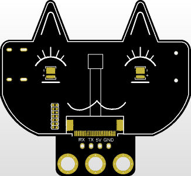

[TOC]

## 概述

fox:bit摄像头采用ESP32-S模组与OV2640摄像头模组，支持最小系统独立工作，可广泛应用于各种物联网应用、家庭智能设备、工业无线控制、无线监控、二维码无线识别、无线定位系统信号等物联网应用，支持二次开发以及各种物联网设备应用。

## 产品参数

- 采用低功耗、双核 32 位 CPU，可作为应用处理器。
- 主频高达 240MHz，算力达到 600 DMIPS。
- 内置 520 KB SRAM，外部 8MB PSRAM。
- 兼容 UART 。
- 支持 OV2640 和 OV7670 摄像头，内置闪光灯。
- 支持 TF 卡、多种休眠模式、WIFI 上传和 STA/AP/STA+AP 工作模式。
- 内置 Lwip 和 FreeRTOS。
- 支持 Smart Config/AirKiss 智能配置。
- 电源范围：5V
- 平均工作电流：0.21A
- 产品尺寸：55*51mm

## 原理图

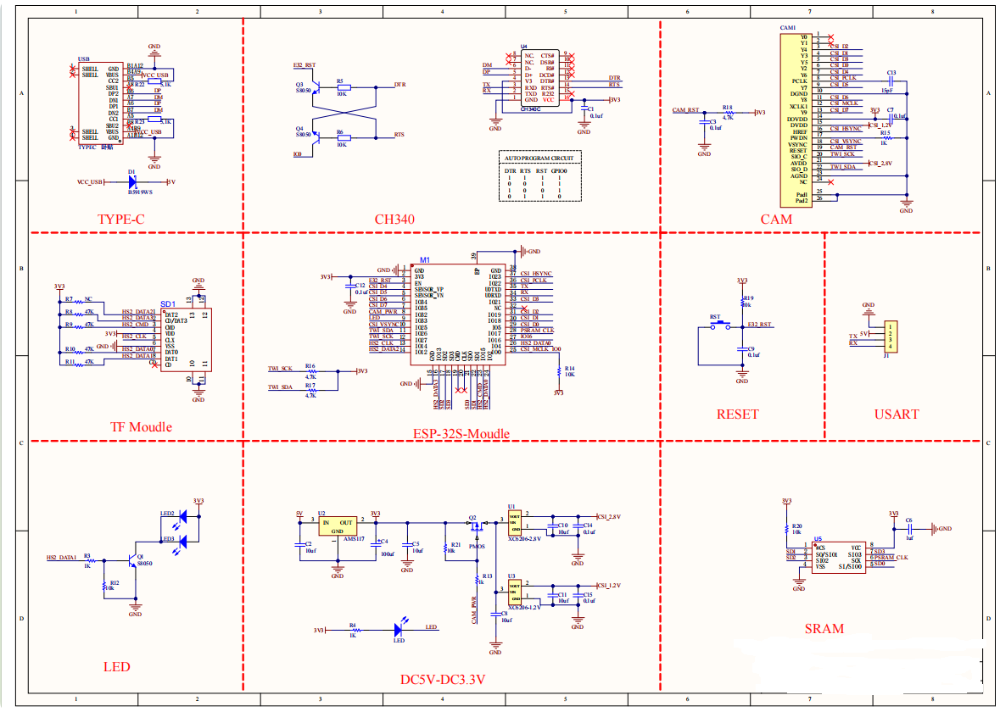

## 连接与环境配置

**安装Arduino IDE（Windows）**

我们先到Arduino官方的网站：https://www.arduino.cc/en/software/#ide

下载最新版本的arduino开发软件，进入网站之后,如下图：

Arduino 软件有很多版本，有wodows,mac linux系统的（如下图），而且还有过去老的版本，你只需要下载一个适合系统的版本即可。

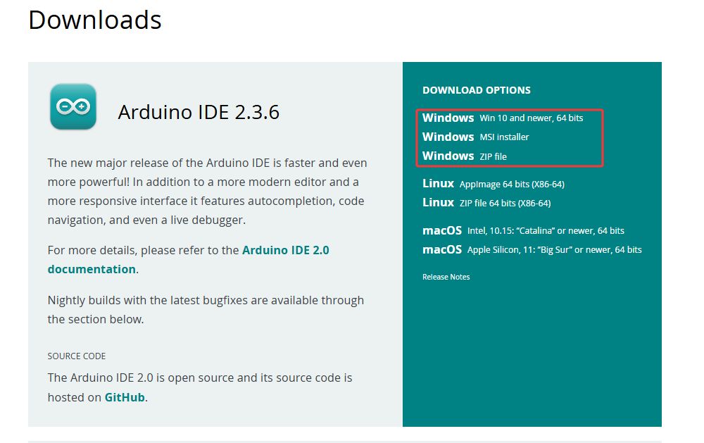

这里我们以Windows系统的为例给大家介绍下载和安装的步骤。Windows系统的也有两个版本，一个版本是安装版的，一个是下载版的不用安装，直接下载文件到电脑，解压缩就可以用了。

一般情况下，我们点击JUST DOWNLOAD就可以下载了。

**环境配置**

第一步：使用Type-C数据线连接电脑与fox:bit摄像头；

第二步：将摄像头和 SD 卡插入fox:bit摄像头SD卡槽；

首先打开Arduino IDE，File-->Preferences-->Setings-->Lauguage;修改为简体中文接下来点击“OK”，就会自动切换为中文。

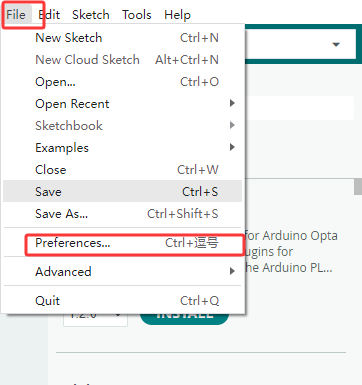

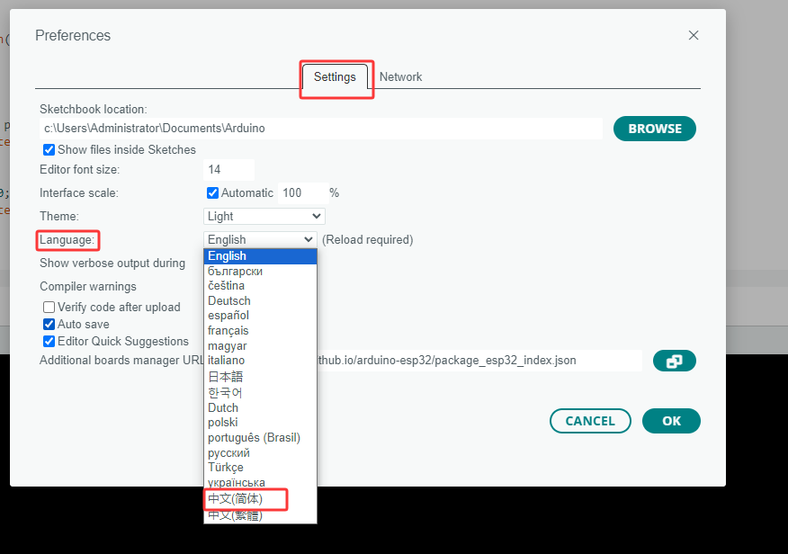

设置测试环境：
如果在 Arduino IDE 的板子类型中找到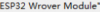，可以跳到设置环境。

配置 esp32：转到 文件-->首选项，
配置 ESP url
复制 “https://dl.espressif.com/dl/package_esp32_index.json” 到“Additional Board Manager URLs”

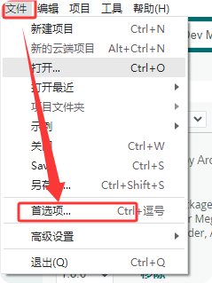

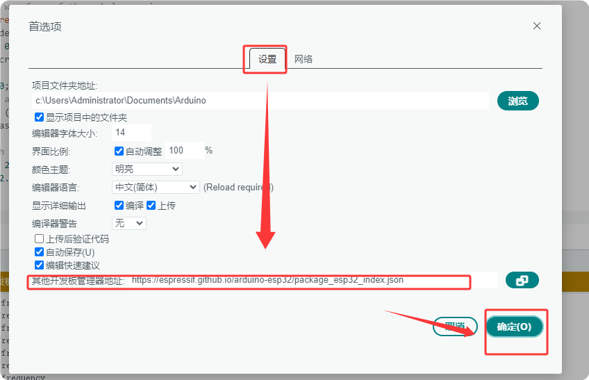

配置开发板：打开工具-->板：“Arduino UNO”-->板管理器）
搜索 esp32 选择版本并安装;）

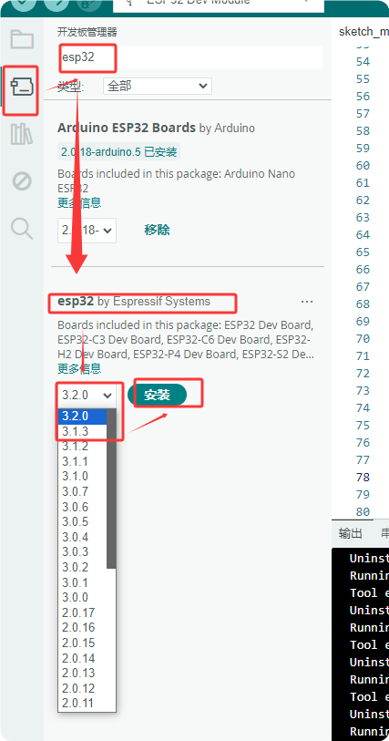

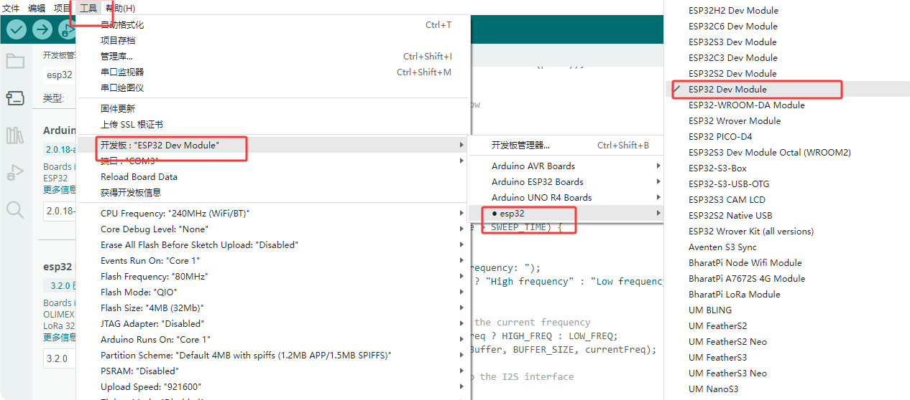

## 示例代码

第 1 步：确保串口和板型参数正确

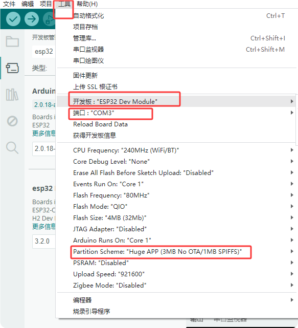

选择示例代码

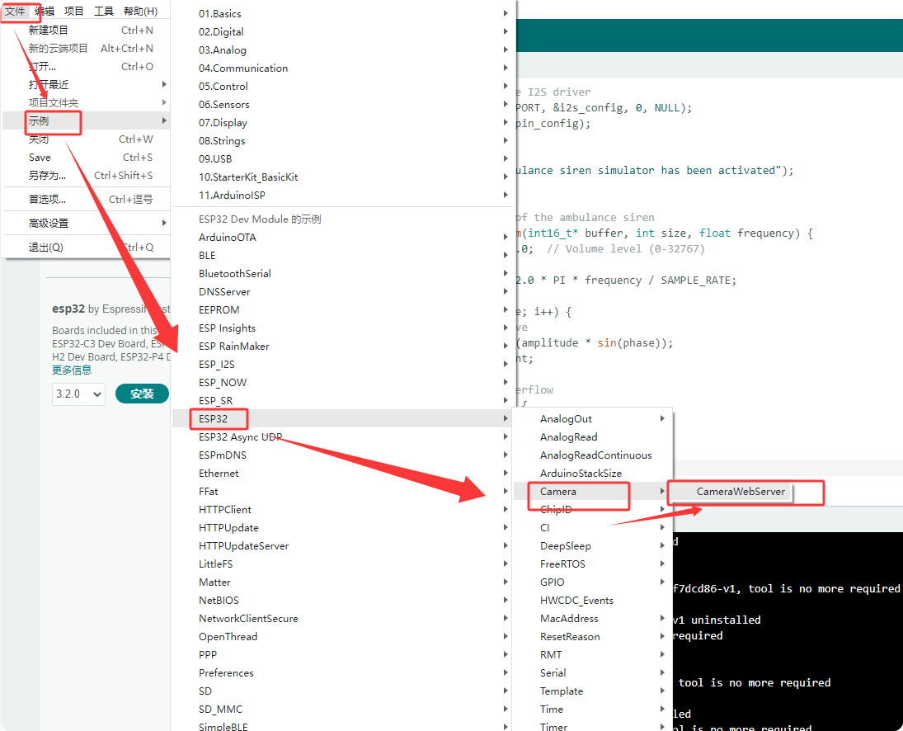

修改摄像头类型：改成 esp32-cam

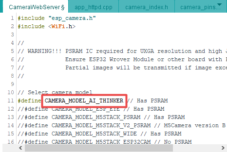

配置 WiFi：该WIFI要和所使用的电脑处于同一局域网内

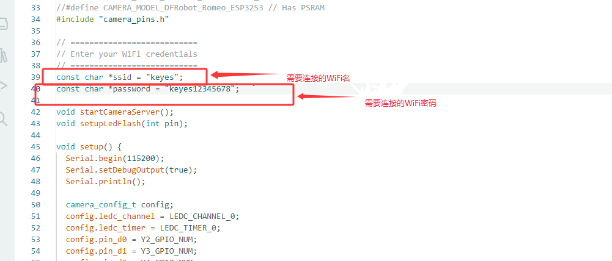

点击IDE中的按钮进行代码的编译与烧录

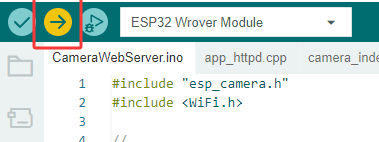

如果 IDE 显示如下图，则表示测试代码上传成功。 编程完成后，打开 Arduino 右上角的 Serial monitor

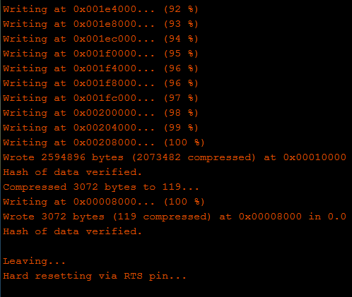

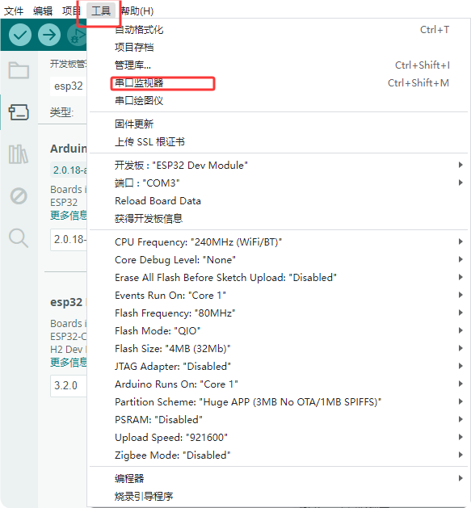

**测试**

选择 115200 波特率，按下重置按钮，LED 指示灯将闪烁。如果无法连接 WiFi，请再次按下重置按钮。

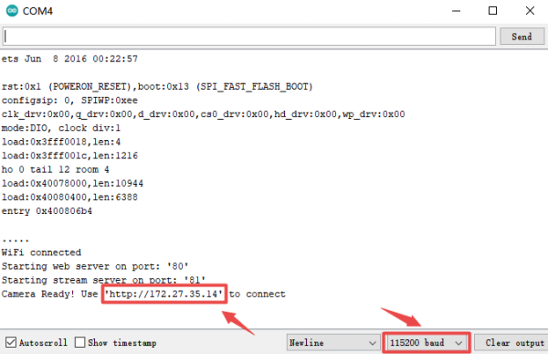

步骤1： 通过WiFi将电脑连接到开发板，并将上面显示的IP地址粘贴到Google或Foxfire浏览器的搜索框中。（其他浏览器可能不兼容）

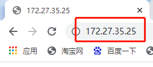

步骤 2：设置参数如下，然后单击 开始流式传输。然后相机开始工作，WiFi 模块发热，串口显示大量通信数据。您无需担心。

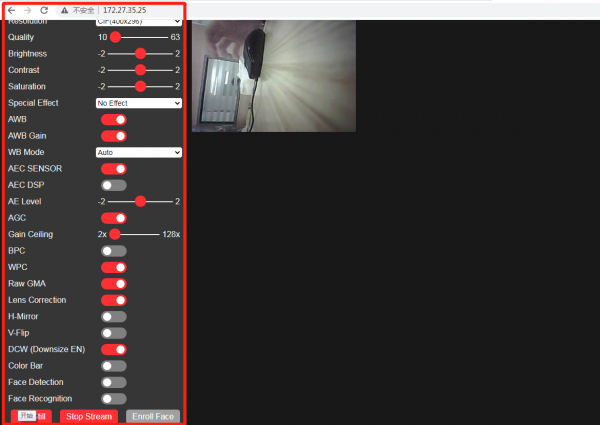

## 测试结果

将出现视频屏幕 请注意： 串口监视器上应正常显示 IP 地址，摄像机应连接好，视频画面清晰。